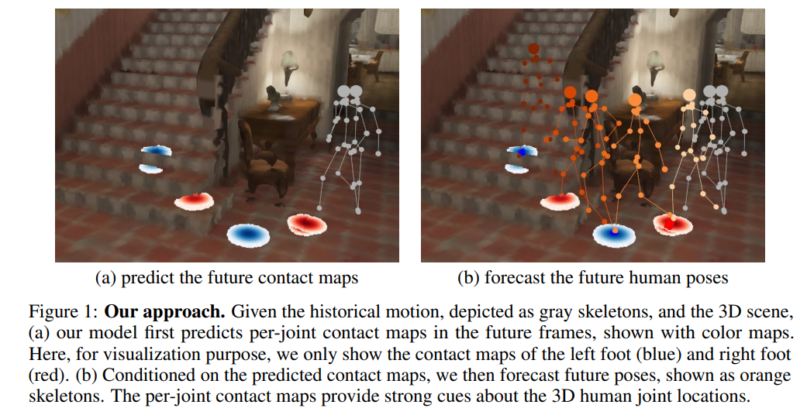
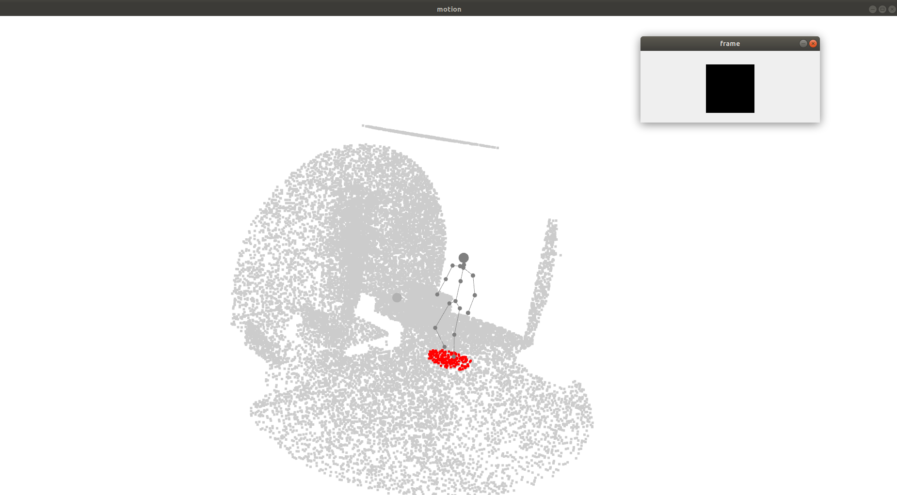

## Contact-aware Human Motion Forecasting


This is the code for the paper

Wei Mao, Miaomiao Liu, Richard Hartley, Mathieu Salzmann. 
[_Contact-aware Human Motion Forecasting_](https://github.com/wei-mao-2019/ContAwareMotionPred). In NeurIPS 22.

[[paper](https://arxiv.org/abs/2210.03954)] [[talk](https://neurips.cc/virtual/2022/poster/54945)]

### Dependencies
* Python >= 3.8
* Open3D >= 0.15.0
* [PyTorch](https://pytorch.org) >= 1.8
* Tensorboard
* numba

tested on pytorch == 1.8.1

### Datasets
#### GTM-IM
For the original dataset please contact the authors of [Long-term Human Motion Prediction with Scene Context](https://zhec.github.io/hmp/).

* *Data pre-process*. After downloading the original GTA-IM Dataset (the FPS-30 one), unzip every file and put it in the data foloder. Run the code below to process the dataset. 

```
python process_gta_dataset.py
```

The file structure of data folder should look like below. 

* We also provide a subset of the processed test set on [google drive](https://drive.google.com/drive/folders/1W6Qu3PhS0g79_Bb12jjsPZ_Ibc80lzXI?usp=sharing). Download the processed dataset and put it in datasets folder.

```
data
    ├── GTA-IM-Dataset
    │   ├── 2020-06-03-13-31-46
    │   │   ├── 0000.jpg
    │   │   ├── 0000.png
    │   │   ├── 0000_id.png
    │   │    ......          
    │   ├── 2020-06-04-23-14-02
    │    ......
    │   
    ├── data_v2_downsample0.02
    │   ├── 2020-06-04-23-14-02_r013_sf0.npz
    │   ├── 2020-06-04-23-08-16_r013_sf0.npz
    │   └── 2020-06-04-23-08-16_r013_sf1.npz
    └── 
```

### Training and Evaluation
* We provide YAML configs inside ``cfg/``. These configs correspond to pretrained models in ``results``.
* The training and evaluation command is included in ``run.sh`` file.
* The pretrained model can be downloaded from the same google drive link and the downloaded folders should be put in ``results`` folder.

### Visualization
Run the following code to visualize the results.

```
python eval_gta_vis.py
```

The interface should look like this




### Citing

If you use our code, please cite our work

```
@inproceedings{mao2022contact,
  title={Contact-aware Human Motion Forecasting},
  author={Mao, Wei and Liu, Miaomiao and Hartley, Richard and Salzmann, Mathieu},
  journal={NeurIPS},
  year={2022}
}

```

### Acknowledgments

The overall code framework (dataloading, training, testing etc.) is adapted from [DLow](https://github.com/Khrylx/DLow). 

The 3D scene encoding framework (code in ``./pcvnn/``) is adapted from [PVCNN paper](https://github.com/mit-han-lab/pvcnn)

Part of the visualization code and the data processing code is from [GTA-IM dataset](https://github.com/ZheC/GTA-IM-Dataset). 

### Licence
MIT
